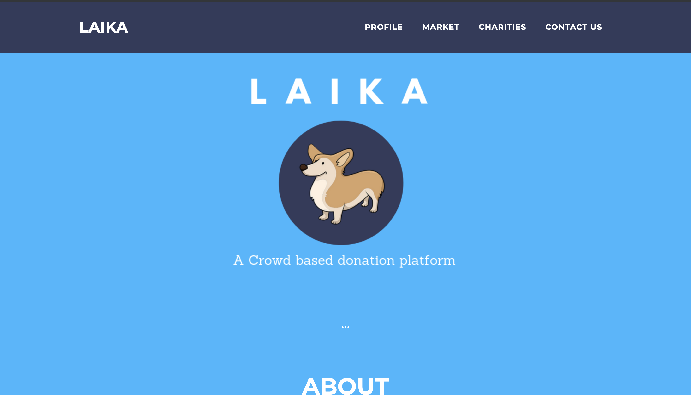
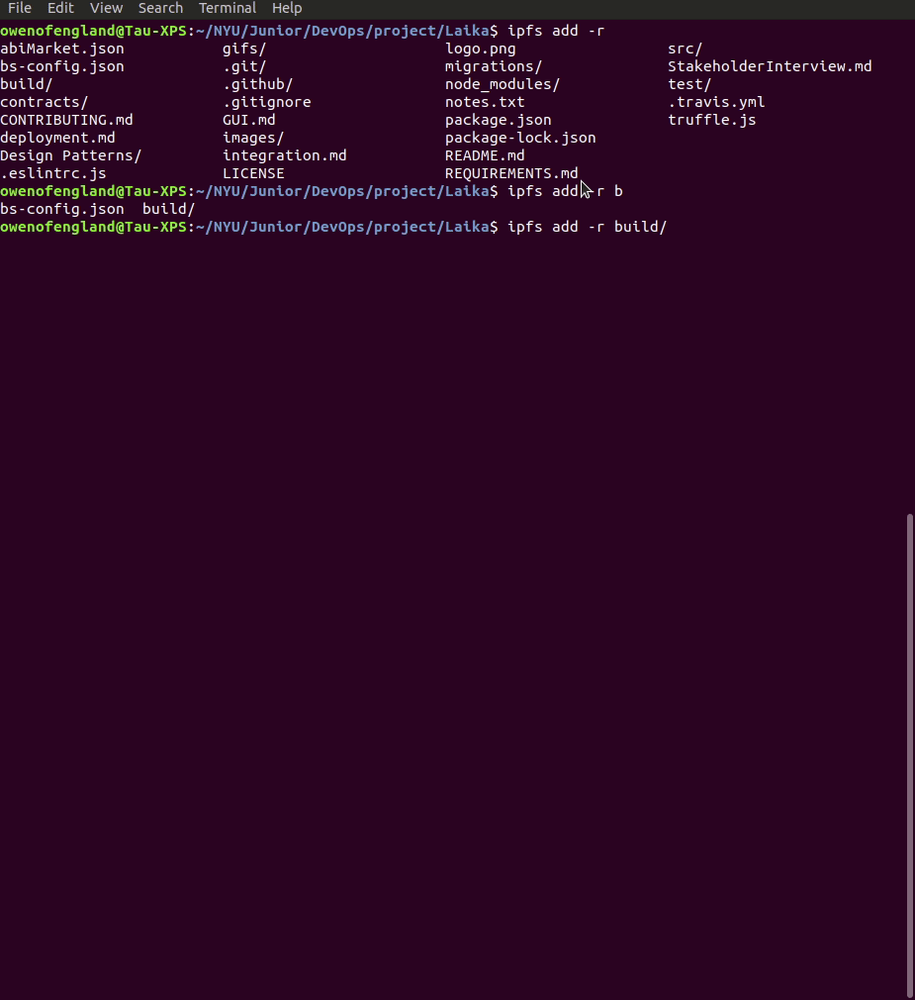
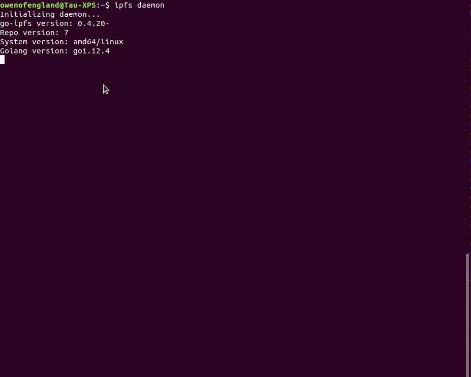
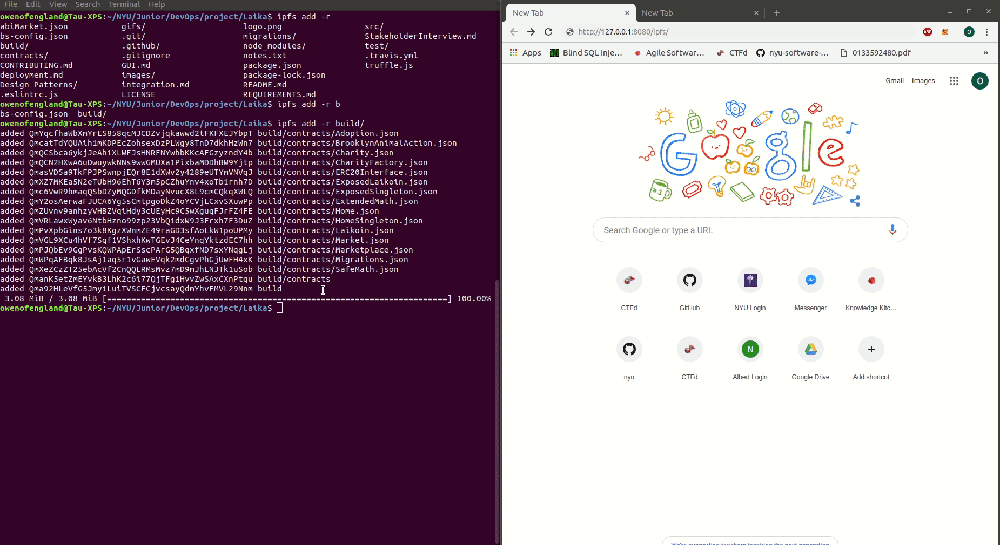
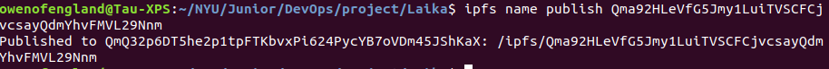

# Laika: A Crowd Donation Project

[Web GUI](GUI.md)

## Overview
Crowd Donation Platform where all your donations to a charity will be tracked so you know how you money was spent exactly.

## A solution for transparency

Lack of transparency in charitable donations has deterred many from making a donation and organization from being held accountable for their actions. We want to help increase transparency to encourage more donation and bring charities closer to achieving their missions.

Laika Crowd Funding, strives to become a powerful platform where approved 503c organizations can sign up to receive funds using crypto and a blockchain – anyone with a computer can help raise funds with full transparency. Currently, there are some websites which users can mine “Monero” for a good cause. However, the lack of transparency of “Monero” leaves donors wondering where their contributions actually go.

Our system uses Ethereum Blockchain, guaranteeing confidence in the donation as all transactions are public. Users select from a list of verified donors and they can donate Laicoins to them. The 503c charity will receive the funds and spend them on a market place within the platform. All purchases are public and the user can track where every coin was spent on. With this straightforward platform we hope to increase the willingness to donate and leave users with a peace of mind.

In the future we hope to make our coin web browser mineable, so anyone can just leave a tab open to donate to their favorite charity, facilitating the process and encouraging more people to become generous. We also hope that in the future when all goods and services will be tokenized digitally, we will be able to trace how charities spend their donations even ourside of our marketplace.

Please read [REQUIREMENTS.md](https://github.com/nyu-software-engineering/crowd-donation/blob/master/REQUIREMENTS.md) for a better understanding of project details.

## Getting Started

* git clone https://github.com/nyu-software-engineering/crowd-donation.git

* npm install -g truffle

### Prerequisites

* Node.js: [Download](https://nodejs.org/en/download/)
* Truffle Framework: npm install -g truffle
* Solidity: npm install -g solc
* Ganache: [Download](https://truffleframework.com/ganache)
* React: npm install -g create-react-app
* Web3.js: npm install web3
* MongoDB: [Download](https://www.mongodb.com/download-center/community)
* IPFS: [Download](https://docs.ipfs.io/introduction/install/)

### Installing

1. Install latest version of Node.js for your OS here: [Download] (https://nodejs.org/en/download/)
		* Verify installation with: node -v; npm -v

2. Install Ganache: [Download] (https://truffleframework.com/ganache)
		* Create a new workspace in Ganache (procede without changing anything in the settings!)

3. Install MongoDB: [Download] (https://www.mongodb.com/download-center/community)

4. Install IPFS: [Download] (https://docs.ipfs.io/introduction/install/)
		* Follow instructions in a section below for how to use

5. Install Metmask for your browser: [Download] (https://metamask.io/)
		* Register by clicking on fox icon in browser, and following instructions
		* Make sure to save Seed Phrase!
		* Once Done, click on the drop down meny and select Custom RPC, add a network name and with ganache add http://localhost:7545 to the RPC URL to test locally. To switch to one of the accounts provided by Ganache click on your account next to the network and import account. Click on the key symbol next to one of the hashes and copy and paste that into the private key field and import.
		* Or click on the drop down menu at the top and change from Ethereum Main Network to Rinkeby Test Network (otherwise you may spend real money and lose it if you have ether!) if you would like to use the contracts on Rinkeby

6. In order to have ether on the Rinkeby test network go to: [Download] (https://faucet.rinkeby.io/)
		* Follow the instructions, which include making a social media post on a platform like facebook or twitter with your ethereum wallet address (this can be found in MetaMask if you click on the hash number below your profile and above your balance).

7. Globally install the following packages: truffle, solc (solidity programming language), create-react-app, web3

8. Clone the repository from our github to your local machine: https://github.com/nyu-software-engineering/Laika

9. For the contracts (they are also deployed to the Rinkeby Test Net, and this can be seen from below instructions):
		* Open Ganache

		* truffle develop

		* compile

		* migrate

		* test (if you wish to run the smart contract tests)

10. For the front end:
		* cd src; npm run dev

## Running the tests

Running Smart Contract tests

 **Make sure both Truffle and Ganache are installed!**

1. Open ganache
2. From command line: truffle compile
3. From command line: truffle test

## Deployment

* truffle develop

* compile

* migrate

* cd src

* npm run dev

## Trouble shooting
* If Meta Mask is not popping up
* First of all, make sure you don't have any other node than Ganache running in the background, no private node, no other Geth.
* Go to the directory of your truffle project and delete the build directory of that directory.
* Open a fresh Ganache instance and in your terminal truffle migrate --reset --compile-all in your truffle project directory.
* In your browser open Metamask, switch your network to the Main Ethereum Network and then switch back to your private network where your Ganache is running.
* Then just to be safe completely quit and restart the browser, open your Metamask with your password, check if you are still on your private network, and everything should be fixed!

## Built With

* [Node.js](https://nodejs.org/en/)
* [Truffle Framework](https://truffleframework.com/)
* [Solidity](https://solidity.readthedocs.io/en/v0.5.3/#)
* [Ganache](https://truffleframework.com/ganache)
* [React](https://reactjs.org/) - Front-end framework
* [Web3.js](https://web3js.readthedocs.io/en/1.0/#)
* [MongoDB](https://www.mongodb.com/)
* [IPFS](https://ipfs.io/)

## Contributing

Please read [CONTRIBUTING.md](https://github.com/nyu-software-engineering/crowd-donation/blob/master/CONTRIBUTING.md) for details on our code of conduct, and the process for submitting pull requests to us.

## Authors

* [Masaki Kagesawa](https://github.com/MKagesawa)
* [Sean Cao](https://github.com/SeanSCao)
* [Rachel Ruis](https://github.com/Rachelnarios)
* [Owen England](https://github.com/owenofengland)
* [Angela Zhang](https://github.com/sillyangela)

## Acknowledgments
* The open source UI framework is provided by [Black Rock Digital] (http://blackrockdigital.io/)
* The open source market place JQuery shopping cart is provided by [Cody House] (https://codyhouse.co/)

## Demo
Below will all be Demos of our smart contract in action

### See deployed Smart Contracts
You can go to [deployment.md](deployment.md) to find all the smart contracts deployed to Rinkeby testnet.
Links to the Smart Contracts and transactions deploying the contracts are included.

### Check Laikoin Balance
Open Remix, click run on the top right corner, then copy and paste the contract address you want to use next to "At Address" button.
After you click "At Adress", click Deployed Contracts and you will be able to see a list of functions you can call.
Then choose balanceOf and enter your public address.
The output will be displayed in the middle section of Remix.

### Send Laikoin from one address to another
Choose *transfer* function and enter the public address you want to send Laikoin to, and how much.
*Make sure you enter Rinkeby Address! Any public address at other network will result in permanent loss!!*

### Check the balance of recipient (the Recipient started with balance of 1)
The recipient in this case is using My Ether Wallet instead of Metamask for demo purposes. You can sign in to your MEW account, and copy and paste the contract address as well as ABI of Laikoin smart contract to interact with it.

### Register a product on Market Smart Contract
Choose *registerProduct* function under Deployed Contracts. Enter a number for ID, and make sure the ID is not already used. Price is also a number. For name and description, it must be in hexadecimal so use a converter and make sure to add "0x" at the front. When you click the function, a Metamask transction should be triggered.

### See registered product
To view the details of a registered product choose *getProductInfo* function and enter the product ID. Name and description returned are in hexadecimal, so remove "0x" at beggining then use a converter to view data.

### Buy a product
To buy a product, choose *buyProduct* function, and enter the ID of the prodct you want to buy. A Metamask transaction should be triggered.

## IPFS usage

*Note: This will only work after installing IPFS!*

### To put something on IPFS add the folder/documents/files/etc like so and get the hash ID (the -r flag is for recursive)

### Initialize the IPFS daemon, this step is necessary to connect to IPFS hashes at http://127.0.0.1:8080/ipfs/<hash>

### With daemon running, connect to the hash ID (either one provided to you, or one from adding to IPFS like the first gif)

### If you would like to publish your hash so it can be accessed with an IPFS daemon, run the following command *This may take a while*

### Once it is published and you have the public hash id connect to https://ipfs.io/ipns/<hash>, where hash is the public hash ID given to you after running the previous command

### Our entire code repository as of May 9th, 2019 at 12:54pm is published on ipfs at http://127.0.0.1:8080/ipfs/QmRwBntNNQwbiBau5keRWpE2x8jbLLxcqxS8zD2FGQSxKo
*Remember you need ipfs daemon running in order to connect to this hash!*
