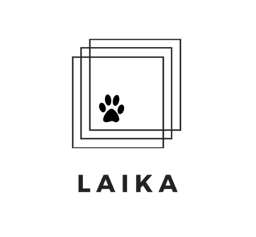

# Laika: A Crowd Donation Project

## Overview
Crowd Donation Platform where all your donations to a charity will be tracked so you know how you money was spent exactly.

## A solution for transparency

Lack of transparency in charitable donations has deterred many from making a donation and organization from being held accountable for their actions. We want to help increase transparency to encourage more donation and bring charities closer to achieving their missions.

Laika Crowd Funding, strives to become a powerful platform where approved 503c organizations can sign up to receive funds using crypto and a blockchain – anyone with a computer can help raise funds with full transparency. Currently, there are some websites which users can mine “Monero” for a good cause. However, the lack of transparency of “Monero” leaves donors wondering where their contributions actually go.

Our system uses Ethereum Blockchain, guaranteeing confidence in the donation as all transactions are public. Users select from a list of verified donors and they can donate Laicoins to them. The 503c charity will receive the funds and spend them on a market place within the platform. All purchases are public and the user can track where every coin was spent on. With this straightforward platform we hope to increase the willingness to donate and leave users with a peace of mind.

In the future we hope to make our coin web browser mineable, so anyone can just leave a tab open to donate to their favorite charity, facilitating the process and encouraging more people to become generous. We also hope that in the future when all goods and services will be tokenized digitally, we will be able to trace how charities spend their donations even ourside of our marketplace.

Please read [REQUIREMENTS.md](https://github.com/nyu-software-engineering/crowd-donation/blob/master/REQUIREMENTS.md) for a better understanding of project details.

## Getting Started

* git clone https://github.com/nyu-software-engineering/crowd-donation.git

* npm install -g truffle

### Prerequisites

* Node.js: [Download](https://nodejs.org/en/download/)
* Truffle Framework: npm install -g truffle
* Solidity: npm install -g solc
* Ganache: [Download](https://truffleframework.com/ganache)
* React: npm install -g create-react-app
* Web3.js: npm install web3
* MongoDB: [Download](https://www.mongodb.com/download-center/community)

### Installing

Work in progress

## Running the tests

Running Smart Contract tests
**Make sure both Truffle and Ganache are installed!**
1. Open ganache
2. From command line: truffle compile
3. From command line: truffle test

## Deployment

* truffle develop

* compile

* migrate

* cd client

* npm run start

## Built With

* [Node.js](https://nodejs.org/en/)
* [Truffle Framework](https://truffleframework.com/)
* [Solidity](https://solidity.readthedocs.io/en/v0.5.3/#)
* [Ganache](https://truffleframework.com/ganache)
* [React](https://reactjs.org/) - Front-end framework
* [Web3.js](https://web3js.readthedocs.io/en/1.0/#)
* [MongoDB](https://www.mongodb.com/)

## Contributing

Please read [CONTRIBUTING.md](https://github.com/nyu-software-engineering/crowd-donation/blob/master/CONTRIBUTING.md) for details on our code of conduct, and the process for submitting pull requests to us.

## Authors

* [Masaki Kagesawa](https://github.com/MKagesawa)
* [Sean Cao](https://github.com/SeanSCao)
* [Rachel Ruis](https://github.com/Rachelnarios)
* [Owen England](https://github.com/owenofengland)
* [Angela Zhang](https://github.com/sillyangela)

## Acknowledgments
* The open source UI framework is provided by [Black Rock Digital] (http://blackrockdigital.io/)
* The open source market place JQuery shopping cart is provided by [Cody House] (https://codyhouse.co/)
